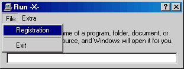



## Super Advanced Trial Edition Scheme and security\. Require Name & serial\. charge for your progs\!

### Description

Super advanced code. Did you ever have a program you wanted to protect. charge money for. or just have some kinda registration system. well now you can. this very secure trial registration system will ensure complete safety from newb and intermediate crackers. complete with keygen and genkey to create a serial conversion to your own needs. using simple text input output i was able to save and check for registartion. Complete with some very nice file security. if somthing has been changed. it checks btw. it will know and say security false. and close down the program. cant trick this one!
 
### More Info
 

             |
---                |---
**Submitted On**   |2001-07-16 19:19:10
**By**             |[meth0s](https://github.com/Planet-Source-Code/PSCIndex/blob/master/ByAuthor/meth0s.md)
**Level**          |Advanced
**User Rating**    |4.2 (25 globes from 6 users)
**Compatibility**  |VB 5\.0, VB 6\.0
**Category**       |[Coding Standards](https://github.com/Planet-Source-Code/PSCIndex/blob/master/ByCategory/coding-standards__1-43.md)
**World**          |[Visual Basic](https://github.com/Planet-Source-Code/PSCIndex/blob/master/ByWorld/visual-basic.md)
**Archive File**   |[Super Adva229117162001\.zip](https://github.com/Planet-Source-Code/meth0s-super-advanced-trial-edition-scheme-and-security-require-name-serial-charge-for-you__1-25102/archive/master.zip)

